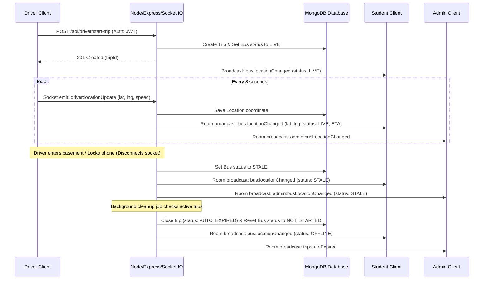

# System Architecture & Data Flow

This document describes the structure, data models, and data flow of the College Bus Tracking & Transport Management System.

## Directory Structure

The project is structured as a monorepo containing a separate frontend `client` (React + Vite) and backend `server` (Node.js + Express + Socket.IO).

```
college-bus-tracking/
├── client/
│   ├── src/
│   │   ├── assets/       # Static assets (images, etc.)
│   │   ├── components/   # Shared UI components (Map canvas, etc.)
│   │   ├── context/      # Context providers (AuthContext)
│   │   ├── hooks/        # React hooks (useGeolocation)
│   │   ├── pages/        # Dashboard panels (Admin, Driver, Student)
│   │   ├── services/     # API/Socket clients (socket connection helper)
│   │   └── utils/        # Geolocation math and utilities (Haversine/ETA)
│   ├── index.html
│   ├── tailwind.config.js
│   └── package.json
├── server/
│   ├── src/
│   │   ├── config/       # Configuration logic (MongoDB setup)
│   │   ├── controllers/  # Route controllers (Auth, Admin, Driver, Student)
│   │   ├── middleware/   # Request interceptors (JWT, Role checking)
│   │   ├── models/       # Database schemas (User, Bus, Trip, Stop, Route, Location)
│   │   ├── routes/       # Express route controllers definitions
│   │   └── services/     # Socket server handlers, background cleanups
│   ├── package.json
│   └── .env
├── docs/
└── package.json
```

---

## Data Flow Diagram

The diagram below outlines how the components communicate in real time.



---

## Location Freshness States

Coordinates are classified by the client and server to prevent rendering stale data as active tracking:

1. **LIVE**: Recent location update received within the last 30 seconds.
2. **STALE / WEAK GPS**: No update received for >= 30 seconds (often due to browser backgrounding, OS battery saving, network lag, or brief disconnection).
3. **OFFLINE**: No update received for >= 3 minutes, or the driver socket disconnected, or the trip is ended.
4. **NOT STARTED**: No active trip exists for this vehicle.
